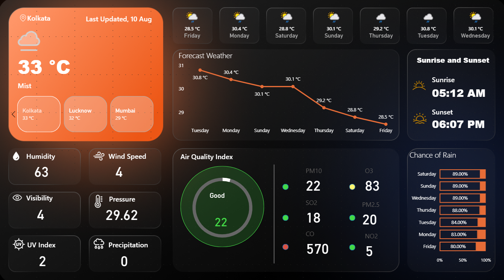
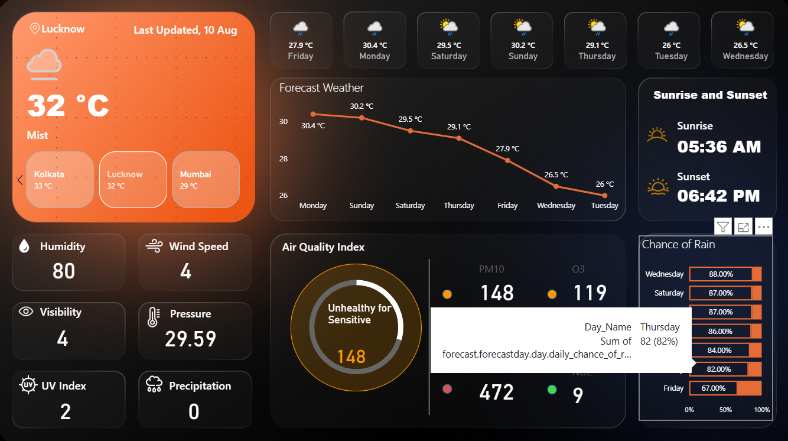

# ☀️ Weather Insights Dashboard – Real-Time Data Visualization in Power BI

## 📌 Overview
The **Weather Insights Dashboard** is an interactive Power BI solution designed to display real-time weather and air quality data in a clean, visually appealing format.  
It integrates **live API feeds** to provide up-to-date conditions, 7-day forecasts, and environmental insights for multiple cities.  
This project demonstrates **advanced Power BI**, **DAX**, and **API integration** skills while delivering a **user-friendly, dark-themed interface** for better readability.

---

## 🎯 Objectives
- Present real-time weather updates in an easy-to-understand layout.  
- Enable quick insights into air quality with AQI ratings and pollutant breakdowns.  
- Provide 7-day forecast trends using a combination of line and card visuals.  
- Support decision-making by showing rain probability and key weather indicators.  
- Strengthen skills in Power BI, DAX, API integration, and custom visuals.  

---

## 🚀 Features
- 🌡 **Current Weather**: City-wise comparison of temperature, humidity, and wind speed.  
- 📊 **7-Day Forecast**: Temperature trends displayed with line charts and KPIs.  
- 💨 **Air Quality Index (AQI)**: Includes pollutant details – PM10, PM2.5, CO, NO₂, SO₂, O₃.  
- 🌅 **Sunrise & Sunset**: Daily timings for each city.  
- ☔ **Rain Probability**: Chart showing chance of precipitation.  
- 📈 **KPIs**: Humidity, wind speed, UV index, visibility, and precipitation.  

---

## 🛠 Tech Stack
- **Power BI Desktop** – for dashboard creation and visualization  
- **DAX (Data Analysis Expressions)** – for custom measures and calculations  
- **API Data Source** – live weather & AQI data via Power Query  
- **Power Query Editor** – for data cleaning and transformation  
- **Custom Visuals (AppSource)** – advanced charts, gauge meters  

---

## 📷 Dashboard Preview

---

---

---

## 📚 Key Learnings
- Integrating live API data into Power BI dashboards.  
- Applying **conditional formatting** for better insights.  
- Designing **dark-themed dashboards** for enhanced readability.  
- Using **gauge visuals** for KPI tracking.  
- Combining **line charts with card visuals** for trend analysis.  

---

## 📄 How to Use
1. Download the `.pbix` file from this repository.  
2. Open it in **Power BI Desktop**.  
3. Refresh the data to fetch live API values (API key required).  

---

## 📌 Author
**[Prakruti Parmar](https://github.com/prakrutiparmar)**  
📧 prakruti.parmar96@example.com  

---

### ⭐ If you like this project, consider giving it a star on GitHub!
